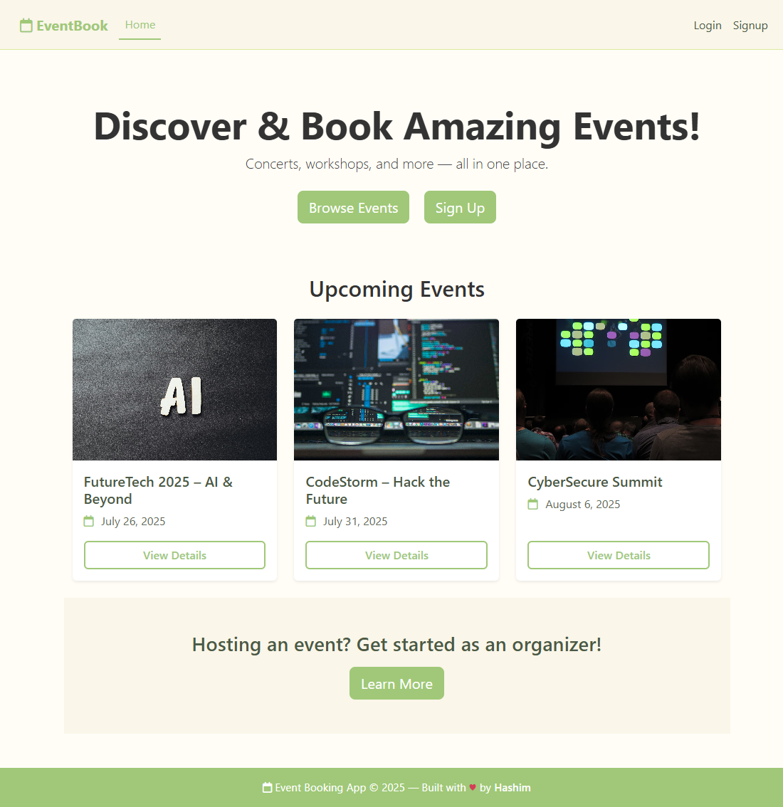
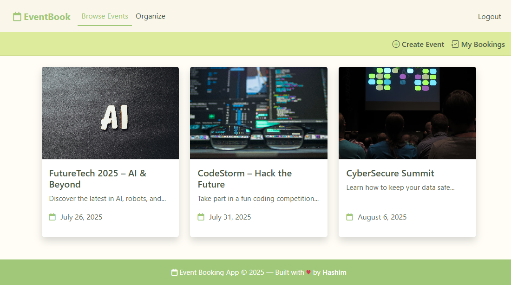
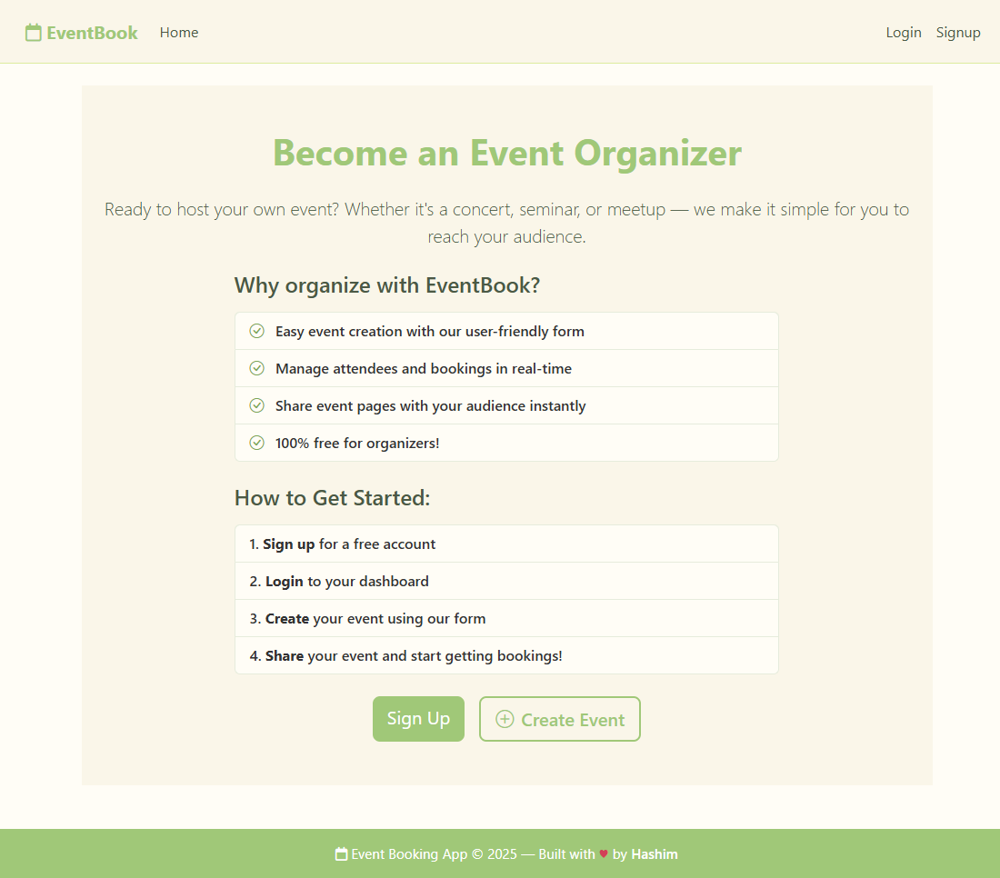
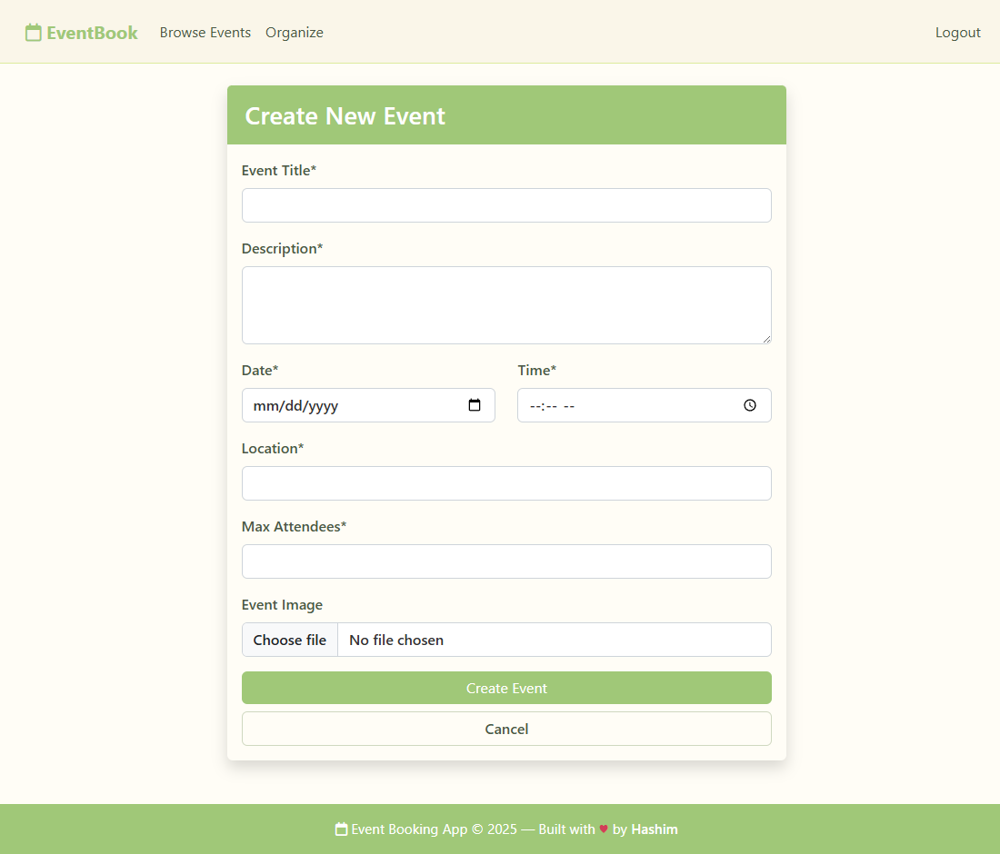

# 📅 EventBook

A full-stack web application for discovering, creating, and managing events. Users can browse events, book seats, and become event organizers. Built with **Node.js**, **Express**, **MongoDB Atlas**, **EJS**, and styled using **Bootstrap** and **custom CSS**. The project follows the **MVC architecture** and uses **RESTful APIs**.

---

## 👀 Preview

🔗 **Live App**: Test the live version [here](https://event-booking-hashim.vercel.app)

### Landing Page (Before Login)  
  
*A preview of the landing page with upcoming event listings.*

### Browse Events  
  
*Users can explore and view available events.*

### Organizer Page  
  
*Information page for becoming an event organizer.*

### Create Event Form  
  
*Form for creating new events (only for logged-in users).*

---

## 🚀 Features

- ✅ User registration and login with **session-based authentication**  
- 🔐 Secure login system implemented with **Passport.js**  
- 📅 Browse all available events  
- 📝 Organizers can **create, edit, and delete events**  
- 🎟️ Users can book events and view their bookings  
- ☁️ Cloud-based image storage using **Cloudinary**  
- 🗄️ Connected to a **cloud database using MongoDB Atlas**  
- 📁 MVC project structure  
- 🎨 Clean and responsive UI with **Bootstrap** and **custom CSS**  
- 🌐 Deployed on **Vercel** 

---

## 🛠️ Tech Stack

### Backend:
- Node.js  
- Express.js  
- express-session  
- Passport.js  
- MongoDB / MongoDB Atlas
- Cloudinary (for image uploads)    

### Frontend:
- Bootstrap  
- Custom CSS  
- EJS (Embedded JavaScript Templates)  

### Architecture:
- MVC pattern (Model-View-Controller)  
- RESTful API design  

### Deployment:
- Vercel  

---

## 📁 Getting Started

### 1. Clone the repository

```bash
git clone https://github.com/047Hashim/event-booking-app.git
cd event-booking-app
```
### 2. Install dependencies
```bash
npm install
```
### 3. Set Up Environment Variables
Create a .env file in the root directory:
```env
CLOUD_NAME=your_cloudinary_name
CLOUD_API_KEY=your_cloudinary_api_key
CLOUD_API_SECRET=your_cloudinary_api_secret

SECRET=your_session_secret
ATLASDB_URL=your_mongo_atlas_connection_string
NODE_ENV=production
```
**Note**:If .env is not created, default values from app.js will be used:
```js
const dbUrl = process.env.ATLASDB_URL || "mongodb://127.0.0.1:27017/test";
const secretValue = process.env.SECRET || "mysecret_value";
```
### 4. Start the Application

```bash
node app.js
```
Then open your browser and visit [http://localhost:8080](http://localhost:8080) to view the app locally.

---
## 🧠 What I Learned

- **Validating** event dates and times **to prevent creation of past events**  
- **Integrating** Cloudinary **for efficient image uploads and storage**  
- **Implementing secure** authentication using **Passport.js** with `express-session`  
- **Building** RESTful routes in Express **to handle events and bookings**
- **Establishing** secure database connections with **MongoDB Atlas**    
- **Architecting** the application using **MVC pattern for better maintainability**  
- **Designing** responsive interfaces with **Bootstrap** and **reusable EJS templates**  
- **Deploying** the app with **environment variables** on **Vercel**

 ---

## 👤 Author

**Syed Hashim Naqvi**  
GitHub: [@047Hashim](https://github.com/047Hashim)
